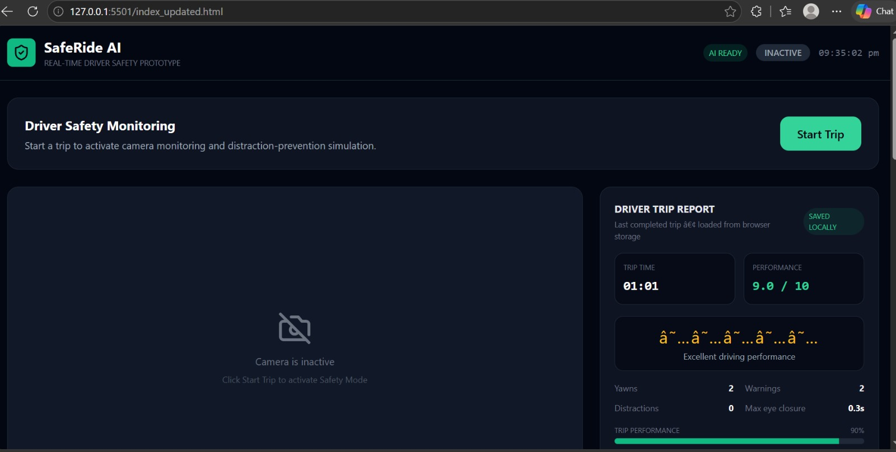
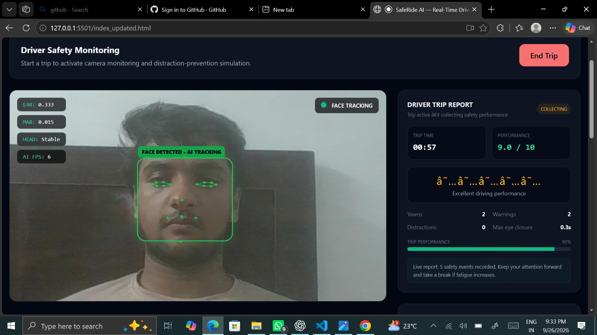
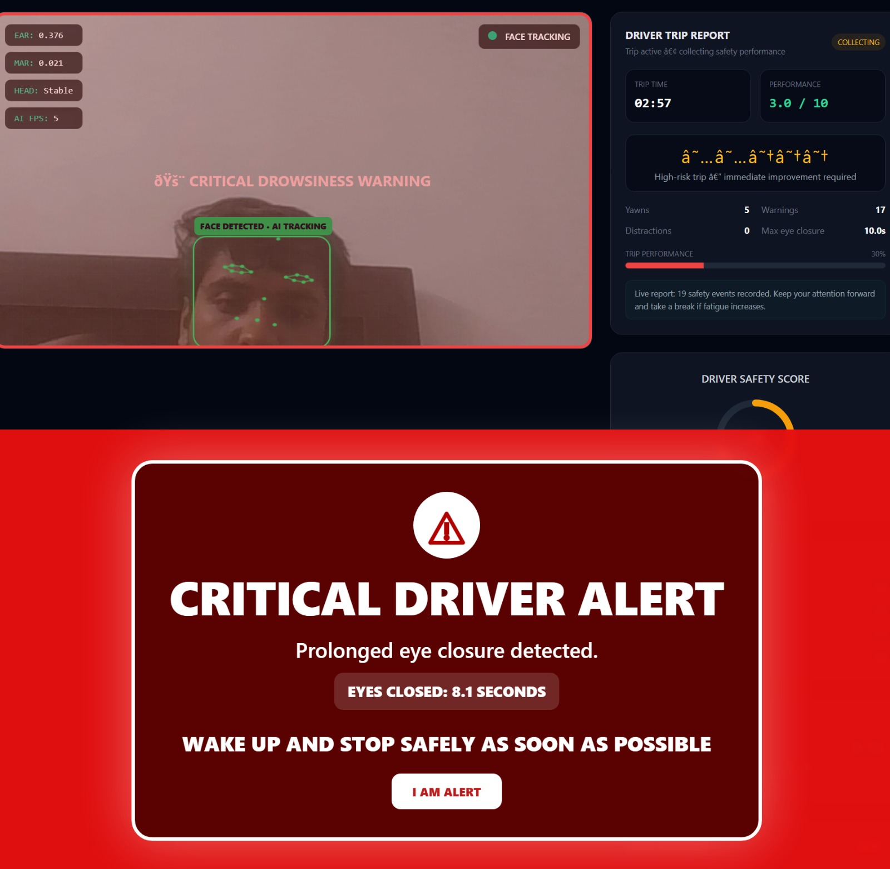
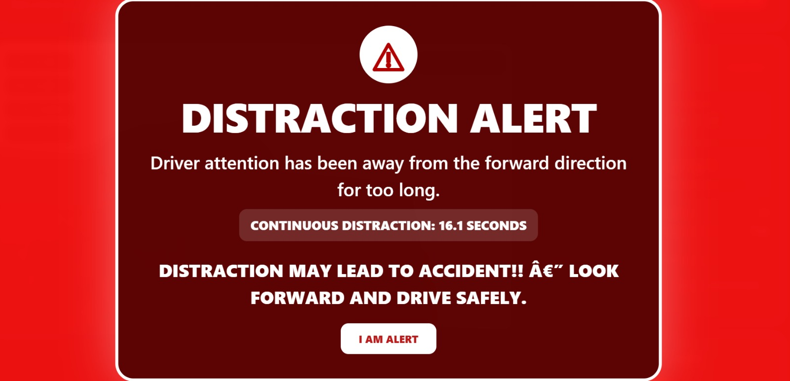
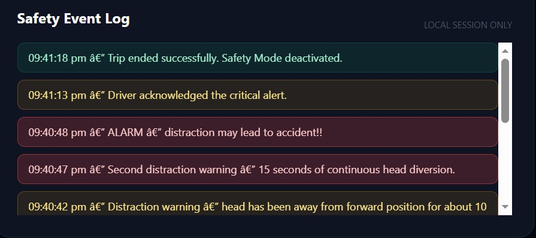
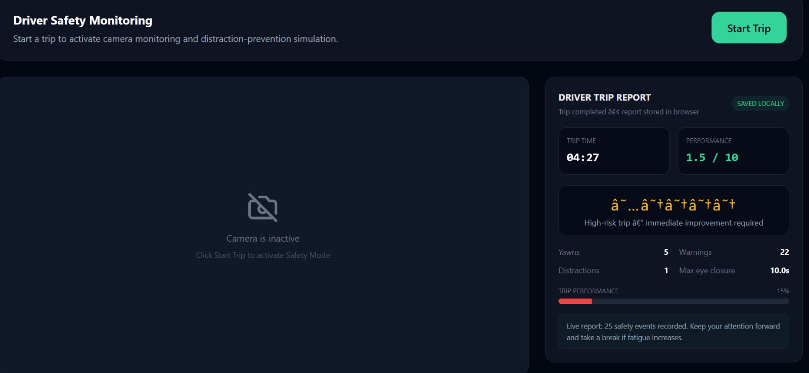

# 🚗 SafeRide AI

### Your AI Co-Pilot for Safer Driving

> A smartphone-first driver safety system that uses real-time computer vision to detect drowsiness, yawning, and driver distraction during an active trip.

---

## 📌 Overview

**SafeRide AI** is an AI-powered driver safety and surveillance system designed to provide real-time awareness of potentially unsafe driver behavior.

The system uses a smartphone/browser camera to monitor the driver's face during an active trip. Facial landmarks are processed using **MediaPipe Face Landmarker**, while JavaScript-based computer-vision logic derives safety signals such as:

- 👁️ Prolonged eye closure
- 🥱 Yawning
- 👀 Head orientation / distraction
- 🚨 Escalating safety alerts

The detected signals are evaluated to determine the driver's current safety state and provide appropriate warnings.

SafeRide AI also maintains trip-level safety information through a **FastAPI backend and SQLite database**, enabling trip history and safety reports.

---

## 🎯 Problem Statement

Drivers can become unsafe due to:

### 😴 Driver Fatigue & Drowsiness
Prolonged eye closure and fatigue can reduce driver awareness.

### 📱 Driver Distraction
Looking away from the road for extended periods can reduce attention to the driving environment.

### ⚠️ Lack of Real-Time Safety Monitoring
Traditional trip systems primarily focus on transportation and trip management rather than continuous driver-state monitoring.

SafeRide AI addresses this gap by providing a real-time driver safety layer during an active trip.

---

## 💡 Our Solution

SafeRide AI introduces a **booking/trip-based driver safety mode**.

When a trip starts:

```text
Trip Starts
     ↓
Safety Mode Activated
     ↓
Smartphone Camera Monitoring
     ↓
Facial Landmark Detection
     ↓
Feature Extraction
     ├── Eye Closure
     ├── Yawning
     └── Head Orientation
     ↓
Risk / Safety Decision
     ↓
Real-Time Warning / Alert
     ↓
Trip Safety Data & Report


---

## 📸 Screenshots & Demo

The SafeRide AI prototype provides a real-time driver monitoring interface with safety alerts, event logging, and trip-level reporting.

### 🏠 Main Interface



### 🚗 Active Trip Monitoring



### 😴 Drowsiness Detection



### 🥱 Fatigue Detection


### 👀 Distraction Detection



### 📋 Safety Event Log



### 📊 Trip Safety Report

